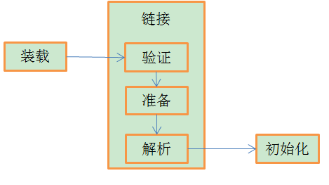

## java.lang.ClassLoader类介绍

java.lang.ClassLoader类的基本职责就是根据一个指定的类的名称，找到或者生成其对应的字节代码，然后从这些字节代码中定义出一个Java 类，即 java.lang.Class类的一个实例。

ClassLoader提供了一系列的方法，比较重要的方法如：


## JVM中类加载器的树状层次结构

Java 中的类加载器大致可以分成两类，一类是系统提供的，另外一类则是由 Java 应用开发人员编写的。 

### 引导类加载器（bootstrap class loader）
它用来加载 Java 的核心库(jre/lib/rt.jar)，是用原生C++代码来实现的，并不继承自java.lang.ClassLoader。

加载扩展类和应用程序类加载器，并指定他们的父类加载器，在java中获取不到。 

### 扩展类加载器（extensions class loader）
它用来加载 Java 的扩展库(jre/ext/*.jar)。Java 虚拟机的实现会提供一个扩展库目录。该类加载器在此目录里面查找并加载 Java 类。 

### 系统类加载器（system class loader）
它根据 Java 应用的类路径（CLASSPATH）来加载 Java 类。一般来说，Java 应用的类都是由它来完成加载的。可以通过 ClassLoader.getSystemClassLoader()来获取它。

### 自定义类加载器（custom class loader）
除了系统提供的类加载器以外，开发人员可以通过继承 java.lang.ClassLoader类的方式实现自己的类加载器，以满足一些特殊的需求。

以下测试代码可以证明此层次结构：

```Java
public class testClassLoader {
    @Test
    public void test(){
        //application class loader
        System.out.println(ClassLoader.getSystemClassLoader());
        //extensions class loader
        System.out.println(ClassLoader.getSystemClassLoader().getParent());
        //bootstrap class loader 输出null
        System.out.println(ClassLoader.getSystemClassLoader().getParent().getParent());
    }
}

//可以看出ClassLoader类是由AppClassLoader加载的。他的父亲是ExtClassLoader，ExtClassLoader的父亲无法获取是因为它是用C++实现的。
```

## 双亲委派机制

某个特定的类加载器在接到加载类的请求时，首先将加载任务委托交给父类加载器，父类加载器又将加载任务向上委托，直到最父类加载器，如果最父类加载器可以完成类加载任务，就成功返回，如果不行就向下传递委托任务，由其子类加载器进行加载。

`双亲委派机制的好处: `
保证java核心库的安全性（例如：如果用户自己写了一个java.lang.String类就会因为双亲委派机制不能被加载，不会破坏原生的String类的加载）

`代理模式`

与双亲委派机制相反，代理模式是先自己尝试加载，如果无法加载则向上传递。tomcat就是代理模式。

## 自定义类加载器

### 为什么要自定义类加载器
* 我们需要的类不一定存放在已经设置好的classPath下(有系统类加载器AppClassLoader加载的路径)，对于自定义路径中的class类文件的加载，我们需要自己的ClassLoader
* 有时我们不一定是从类文件中读取类，可能是从网络的输入流中读取类，这就需要做一些加密和解密操作，这就需要自己实现加载类的逻辑，当然其他的特殊处理也同样适用。
* 可以定义类的实现机制，实现类的热部署,如OSGi中的bundle模块就是通过实现自己的ClassLoader实现的。

### *自定义类加载器写法


## 类加载过程详解

JVM将类加载过程分为三个步骤：装载（Load），链接（Link）和初始化(Initialize)



1. 装载: 查找并加载类的二进制数据；

2. 链接: 验证,确保被加载类信息符合JVM规范、没有安全方面的问题。准备,为类的静态变量分配内存，并将其初始化为默认值。解析,把虚拟机常量池中的符号引用转换为直接引用。

3. 初始化：为类的静态变量赋予正确的初始值。

ps:解析部分需要说明一下，Java 中，虚拟机会为每个加载的类维护一个常量池【不同于字符串常量池，这个常量池只是该类的字面值（例如类名、方法名）和符号引用的有序集合。 而字符串常量池，是整个JVM共享的】这些符号（如int a = 5;中的a）就是符号引用，而解析过程就是把它转换成指向堆中的对象地址的相对地址。

类的初始化步骤：

1）如果这个类还没有被加载和链接，那先进行加载和链接

2）假如这个类存在直接父类，并且这个类还没有被初始化（注意：在一个类加载器中，类只能初始化一次），那就初始化直接的父类（不适用于接口）

3）如果类中存在static标识的块，那就依次执行这些初始化语句。