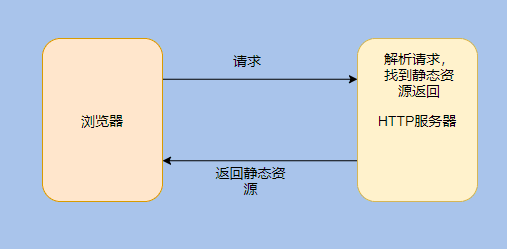
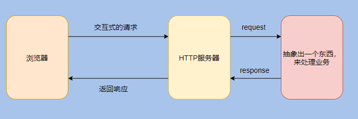
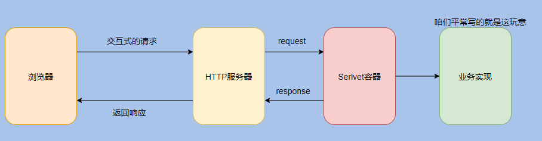
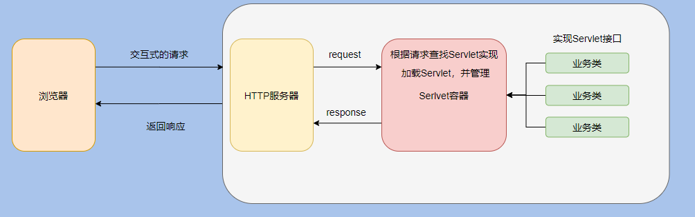

- [web技术的发展](#web技术的发展)
- [servlet容器能提供什么](#servlet容器能提供什么)
- [servlet优点](#servlet优点)
- [框架设计的一个套路](#框架设计的一个套路)
- [最后](#最后)

## web技术的发展

早期，web技术主要用于浏览静态页面：

然而随着时间发展，用户已经不满足于仅浏览静态页面。用户需要一些交互操作，获取一些动态结果。如果基于HTTP协议实现服务器端软件增强功能太过 复杂，所以需要一些扩展机制来实现用户想要的功能。

本质上的需求就是根据 HTTP 请求找到对应的业务实现类然后执行逻辑再返回。

而业务千千万，所以需要规定一个接口，所以业务类都实现这个接口这样才好对接。

这就是接口的含义，就像 USB。

早期使用的Web服务器扩展机制是CGI（Common Gateway Interface，公共网关接口）。

CGI程序在一定程度上解决了用户需求。不过还存在一些不足之处，如CGI程序编写困难，响应时间较长，以进程方式运行导致性能受限。于是1997年，sun公司推出了Servlet技术，作为java阵营的CGI解决方案。

Servlet 其实是 Server Applet，全称 Java Servlet，指的是用Java 编写的服务端程序。

其实指代的是实现 Servlet 接口的那些业务类。

这就是 Servlet 的由来。

而 Servlet 容器其实就是用来管理和加载这些 Servlet 类的，根据 HTTP 请求找到对应的 Servlet 类这就是 Servlet 容器要做的事情。

看到这是不是觉得还能再抽一层？因为这好像也和具体的业务实现没关系？

是的，还能抽一层。

没必要把 Servlet 容器做的事情和具体的业务耦合起来，业务反正照着 Servlet 接口实现就行，这样 Servlet 容器就可以加载它和管理它。

把请求和哪个 Servlet 对应关系也抽象出来，就是 web.xml 了，咱们在配置里面告诉 Servlet 容器对应关系即可。

我图中的业务实现其实对应的就是我们平常的 war 包，这就是业务和 Servlet 容器的解耦。

想必你也听过 Servlet 规范，其实 Servlet 接口和 Servlet 容器这一整套包括目录命名啊啥的合起来就叫 Servlet 规范。

所有相关的中间件按照 Servlet 规范实现，我们也按 Servlet 规范来实现业务代码，这样我们就能在不同场景选择不同的 Web 中间件。

反正规范的目的就是为了对接方便，减少对接成本。

## servlet容器能提供什么

* 通信支持：利用容器提供的方法，你能轻松的让servlet与web服务器对话，而不用自己建立serversocket、监听某个端口、创建流等 等。容器知道自己与web服务器之间的协议，所以你的servlet不用担心web服务器（如Apache）和你自己的web代码之间的API，只需要考 虑如何在servlet中实现业务逻辑（如处理一个订单）。
* 生命周期管理：servlet容器控制着servlet的生与死，它负责加载类、实例化和初始化servlet，调用servlet方法，以及使servlet实例被垃圾回收，有了servlet容器，你不需要太多的考虑资源管理。
* 多线程支持：容器会自动为它所接收的每个servlet请求创建一个新的java线程。针对用户的请求，如果servlet已经运行完相应的http服务方法，这个线程就会结束。这并不是说你不需要考虑线程安全性，其实你还会遇到同步问题，不过这样能使你少做很多工作。
* 声明方式实现安全：利用servlet容器，你可以使用xml部署描述文件来配置和修改安全性，而不必将其硬编码写到servlet类代码中。
* JSP支持：servlet容器负责将jsp代码翻译为真正的java代码。

## servlet优点
* Servlet是单实例多线程的运行方式，每个请求在一个独立的线程中运行，而提供服务的Servlet实例只有一个。
* Servlet具有可升级性，能响应更多的请求，因为Servlet容器使用一个线程而不是操作系统进程，而线程仅占用有限的系统资源。
* Servlet使用标准的API，被更多的Web服务器所支持。
* Servlet使用Java语言编写，因此拥有Java程序语言的所有优点，包括容易开发和平台独立性。
* Servlet可以访问Java平台丰富的类库，使得各种应用的开发更为容易。

至此 HTTP 服务器、Servlet 、Servlet 容器想必都清晰了。

而 Web 容器其实就是 HTTP 服务器 + Servlet 容器，因为单单 Servlet 容器没有解析 HTTP 请求、通信等相关功能。

所以把 Tomcat、Jetty 等实现包含了 HTTP 服务器和 Servlet 容器的功能，称之为 Web 容器。

从我们的分析一层一层的剥离，一层一层的抽象，相信你对 Web 有了更进一步的认识，我再画个 Tomcat 的分析图，应该就很清晰了。

从上面的一步步分析可以看出：其实架构的设计就是一系列相关的抽象。

先是抽象出 HTTP 服务，用来通信和解析协议。

再因为业务的复杂，为了不和 HTTP 服务耦合又抽象了一层 Servlet。

由 Servlet 加载和管理 Servlet ，来控制请求转发到指定的 Servlet 实现类。

然后我们安心的开发业务即可。

因为抽象所以灵活易扩展，比如现在是 HTTP1.1 服务，可以换成 HTTP 2。

现在用 Tomcat 来作为 Servlet 容器，也可以换成 Jetty。

现在用原生的实现 Servlet 来做业务，也可以换成 SpringMVC。

随意变更，因为都抽象出来了，就很好替换，只要遵循约定的接口实现即可。

## 框架设计的一个套路

看完了架构设计的套路，再说说框架套路。

接口和抽象类。

所有中间件设计必用的套路，当然我们自己的代码也会这样用。

先定义一个接口来约定一些动作，能做啥做啥。

然后再定义一个抽象类来实现这个接口，用来实现一些通用的逻辑，做到代码的复用。

然后再搞一些常用的实现类继承抽象类，方便开发者的使用。

剩下的就留给开发者自行扩展即可。

然后抽象类都会使用模板方法，也就是定义执行的流程，具体实现逻辑由子类自行实现。

这就是必用的套路。

接口约束、抽象类代码复用、实现常用实现类方便使用、剩下的自行扩展。

拿 Servlet 举例，首先定义 Servlet 接口。

然后搞了个通用抽象类 GenericServlet，不过这个抽象类逻辑比较简单。

然后搞了个常用的 HttpServlet 继承了 GenericServlet。

## 最后

套路大家应该都 GET 到了。

想必大家都听过“计算机科学中的每个问题都可以用一间接层解决”。

是的，基本上所有问题抽象一层都能解决。

如果一层不够，那就两层。

