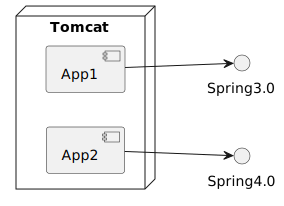
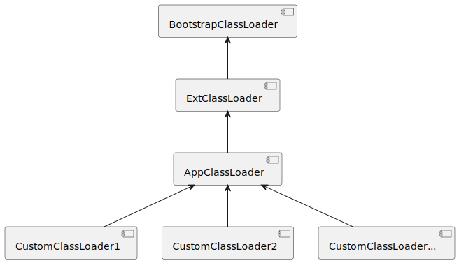
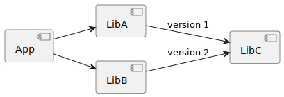

阿里的pandora, 蚂蚁开源的sofa-ark, 都是常见的轻量级依赖隔离容器. 它的主要作用是用来隔离应用和中间件的依赖，也用来隔离中间件之间的依赖。

介绍下轻量级依赖隔离容器的发展过程.

# 1.从Tomcat说起

现在SpringBoot推崇内嵌的Servlet容器，直接把Tomcat内嵌到jar包里了。但在早期业务尚不复杂应用还依赖JSP的时候，Tomcat就像一艘航母，承载着若干个轻量级的应用。

其中有个值得思考问题是，整个Tomcat就是一个Java进程，假若Tomcat上有两个应用都依赖spring-framework，但版本不一致，Tomcat如何决定使用哪个版本的依赖呢？

答案是两个版本都存在。这个答案会引起更大的疑问，Java是靠全类名来标识两个类的，如果两个应用用到不同版本的org.springframework.context.annotation.AnnotationConfigApplicationContext，那这两个类是如何在一个Java进程中共存的呢？

这个问题需要我们对类加载机制有深入的了解才能解答。

# 2.Java类加载机制

Java内置的三个类加载器

* Bootstrap ClassLoader在虚拟机层，用C++编写。用于加载rt.jar等运行时基础类库，也被称作“Root ClassLoader”。

* ExtClassLoader是用于加载JAVA_HOME/lib/ext/*.jar目录的JDK扩展类库。是JDK2.0引入标准扩展机制时添加的类加载器。

* AppClassLoader是用于加载类路径下的第三方类库，也被称为“SystemClassLoader”，可以通过ClassLoader.getSystemClassLoader()获取。

应用也可以自定义类加载器。比如去加载网络服务器上的某个jar包，则可以继承ClassLoader或URLClassLoader请求网络进行加载。

`双亲委派机制`可以保证核心类的安全。防止开发者取了和jdk核心类库中一样的包名和类名，委托给父类加载器能保证JDK类库的类优先加载。保证类的唯一性。先检查是否加载过这个类，避免相同类被多次加载。

# 3.打破双亲委派机制

说回Tomcat的问题。要让一个Java进程同时加载Spring3.0和Spring4.0两个版本的类，按照JDK自带的双亲委派模型是没法解决的。因为ClassLoader#loaderClass默认会检查这个类有没有加载过，保证了类在进程中是唯一的。如果我们想加载两个版本的类，需要打破原有的模型: Tomcat会先从war包的/WEB-INF/classes目录尝试加载类，如果失败了再委托给parent加载器。而每个WebApp都会有自己的WebappClassLoader，这样就可以保证每个Webapp的依赖类相互隔离了。

# 4.菱形依赖问题

前面说到的Tomcat这种场景需要在一个进程中加载两个不同版本依赖。

推而广之，还有软件开发过程中经常碰到的菱形依赖问题(Diamond Dependency)。

Maven作为一个Java领域的依赖管理工具，提供了exclusion标签来排除LibC这样的传递依赖，或者直接依赖高版本的库。但这个前提是高版本的依赖需要兼容低版本。向前兼容要保留恶心的祖传代码，这对于有代码洁癖的程序员来说是个极其艰巨的任务，所以除了JDK标准库大多数三方依赖库在升级大版本时会有各种兼容问题，这也是为什么JDK中保留着Vector和StringBuffer这样的上古代码的原因。

如果真出现了LibA和LibB依赖的版本差别大无法兼容，NoClassDefFoundError、NoSuchMethodError等各种错误就会接踵而至，那怎么办呢？

一种方式是直接把别人的代码拷过来，换个包名。这种方式简单粗暴，也许会觉得这个方式很low逼，但其实用的人挺多的，而且不乏业界名流，spring-framework就是这样把cglib的代码拷过来的。但这种方式仅局限于cglib这样没有其他依赖的短小精悍的库。

另一种方式就是之前说的通过打破双亲委派模型的类隔离机制。业界比较知名的就是OSGI，Eclipse中的各种插件相互隔离就是靠OSGI实现，而且还支持插件的动态插拔。OSGI联盟野心很大，曾一度想让OSGI成为Java模块化技术的标准，不过Java9在语法层面提供了JPMS标准，直接颠覆了原有的模块化管理方式。

# 5.阿里的pandora

最初，HSF 1.X为了解决与应用的jar冲突问题，使用OSGi来做隔离。当时淘系大部分的应用都运行在JBoss中，.sar 作为JBoss支持的一种部署格式（与 .war类似），它在JBoss中的默认启动顺序早于.war，符合HSF优先于应用启动完成类导出的需求，因此HSF 1.X的部署包被定为taobao-hsf.sar。

随着集团的业务发展，内部已经有很多诸如HSF、Notify、MetaQ、Diamond、Tair等各种中间件或客户端产品。这些二方包被各个业务系统使用，为了能解决三方包依赖冲突、方便大规模升级并控制二方包升级成本等问题，从HSF 2.X起，“隔离”的功能被独立地交付给Pandora。这时候的“隔离”不再是“HSF与应用的隔离”，而是“中间件与应用的隔离”以及“中间件之间的隔离”。Pandora容器废弃了OSGI框架，只引入了它的隔离机制，重新实现ClassLoader，形成了全新的轻量级隔离容器。

和Tomcat类似，每个Pandora Plugin模块都有自己的ModuleClassLoader，这样就能保证每个中间件Plugin相互隔离。

